# UML Sistem MYMARKET

Dokumen ini menggambarkan struktur dan alur utama aplikasi MYMARKET. Nama pada
diagram sengaja dibuat singkat dalam bahasa Indonesia agar mudah dipelajari.
Nama class asli pada kode tetap dicantumkan pada bagian **Peta Nama Diagram ke
Kode**.

## Daftar Isi

1. Cara membaca diagram
2. Arsitektur dan use case
3. Pewarisan class
4. Login dan hak akses
5. Produk, persediaan, pembelian, dan pemasok
6. Kasir, penjualan, keuangan, dan laporan
7. Chat CEO
8. Sequence, state, dan activity diagram
9. Peta nama sederhana ke class Python
10. Hubungan UML dengan empat pilar PBO

## 1. Cara Membaca Diagram

Simbol relasi yang dipakai:

| Simbol | Arti |
| --- | --- |
| `<|--` | Pewarisan atau inheritance |
| `*--` | Komposisi; bagian ikut hilang ketika induknya dihapus |
| `o--` | Agregasi; objek berhubungan tetapi dapat berdiri sendiri |
| `-->` | Menggunakan atau bergantung pada |
| `"1" -- "*"` | Satu objek berhubungan dengan banyak objek |
| `"0..1"` | Boleh kosong atau maksimal satu |
| `<<entity>>` | Class yang disimpan sebagai tabel database |
| `<<data>>` | Bentuk data masuk atau keluar API |
| `<<service>>` | Class konseptual untuk kumpulan aturan bisnis |

`BaseWaktu` pada diagram adalah nama sederhana untuk `TimestampMixin`. Class ini
memberikan `dibuatPada` dan `diubahPada` kepada class turunannya.

## 2. Gambaran Arsitektur

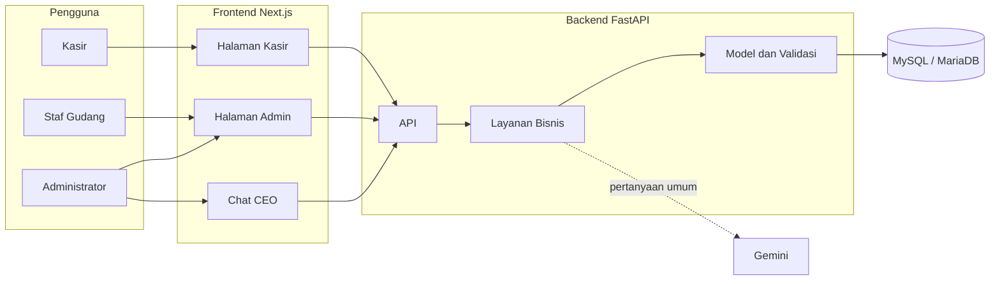
```mermaid
flowchart LR
    subgraph Pengguna
        K[Kasir]
        G[Staf Gudang]
        A[Administrator]
    end

    subgraph Frontend[Frontend Next.js]
        POS[Halaman Kasir]
        ADM[Halaman Admin]
        CHAT[Chat CEO]
    end

    subgraph Backend[Backend FastAPI]
        API[API]
        SVC[Layanan Bisnis]
        MOD[Model dan Validasi]
    end

    DB[(MySQL / MariaDB)]
    AI[Gemini]

    K --> POS
    G --> ADM
    A --> ADM
    A --> CHAT
    POS --> API
    ADM --> API
    CHAT --> API
    API --> SVC
    SVC --> MOD
    MOD --> DB
    SVC -. pertanyaan umum .-> AI
```

Alur sederhananya adalah halaman mengirim request ke API, API memanggil layanan
bisnis, layanan memeriksa dan mengubah model, kemudian model disimpan ke database.

## 3. Use Case Berdasarkan Pengguna

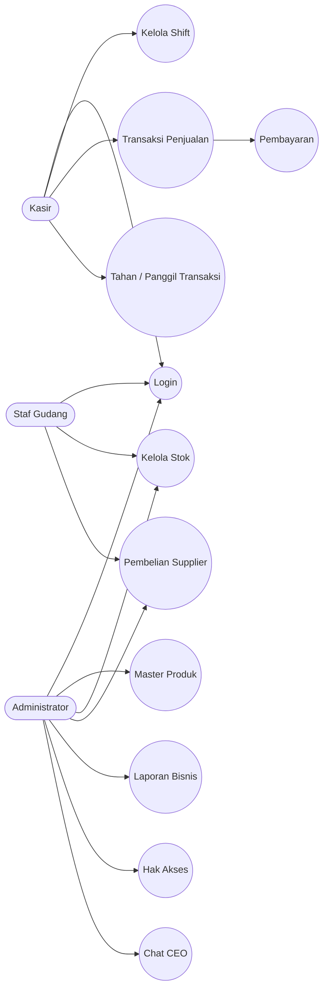
```mermaid
flowchart LR
    Kasir([Kasir])
    Gudang([Staf Gudang])
    Admin([Administrator])

    Login((Login))
    Shift((Kelola Shift))
    Jual((Transaksi Penjualan))
    Bayar((Pembayaran))
    Hold((Tahan / Panggil Transaksi))
    Stok((Kelola Stok))
    Beli((Pembelian Supplier))
    Produk((Master Produk))
    Laporan((Laporan Bisnis))
    Akses((Hak Akses))
    Chat((Chat CEO))

    Kasir --> Login
    Kasir --> Shift
    Kasir --> Jual
    Jual --> Bayar
    Kasir --> Hold

    Gudang --> Login
    Gudang --> Stok
    Gudang --> Beli

    Admin --> Login
    Admin --> Produk
    Admin --> Stok
    Admin --> Beli
    Admin --> Laporan
    Admin --> Akses
    Admin --> Chat
```

## 4. Pewarisan Utama

Diagram ini menunjukkan inheritance yang benar-benar ada pada model Python.

```mermaid
classDiagram
    class BaseDatabase {
        <<framework>>
    }

    class BaseWaktu {
        <<mixin>>
        +datetime dibuatPada
        +datetime diubahPada
    }

    BaseDatabase <|-- Toko
    BaseWaktu <|-- Toko
    BaseDatabase <|-- Peran
    BaseWaktu <|-- Peran
    BaseDatabase <|-- Petugas
    BaseWaktu <|-- Petugas
    BaseDatabase <|-- Produk
    BaseWaktu <|-- Produk
    BaseDatabase <|-- Pemasok
    BaseWaktu <|-- Pemasok
    BaseDatabase <|-- Pesanan
    BaseWaktu <|-- Pesanan
    BaseDatabase <|-- Pelanggan
    BaseWaktu <|-- Pelanggan
    BaseDatabase <|-- Shift
    BaseWaktu <|-- Shift
    BaseDatabase <|-- Voucher
    BaseWaktu <|-- Voucher
    BaseDatabase <|-- Transaksi
    BaseWaktu <|-- Transaksi
    BaseDatabase <|-- TransaksiLive
    BaseWaktu <|-- TransaksiLive
    BaseDatabase <|-- PilihanKatalog
    BaseWaktu <|-- PilihanKatalog
    BaseDatabase <|-- Promo
    BaseWaktu <|-- Promo
    BaseDatabase <|-- BatchProduk
    BaseWaktu <|-- BatchProduk
    BaseDatabase <|-- ReturPenjualan
    BaseWaktu <|-- ReturPenjualan
    BaseDatabase <|-- CatatanKeuangan
    BaseWaktu <|-- CatatanKeuangan
    BaseDatabase <|-- PengaturanBisnis
    BaseWaktu <|-- PengaturanBisnis
    BaseDatabase <|-- Percakapan
    BaseWaktu <|-- Percakapan

    BaseDatabase <|-- Izin
    BaseDatabase <|-- BarangPesanan
    BaseDatabase <|-- MutasiStok
    BaseDatabase <|-- TransferStok
    BaseDatabase <|-- GerakKas
    BaseDatabase <|-- BarangTransaksi
    BaseDatabase <|-- Pembayaran
    BaseDatabase <|-- HitungStok
    BaseDatabase <|-- CatatanAudit
    BaseDatabase <|-- SesiLogin
    BaseDatabase <|-- PerangkatAuthenticator
    BaseDatabase <|-- TantanganAuthenticator
    BaseDatabase <|-- TokenReset
    BaseDatabase <|-- PesanChat
```

Semua model mewarisi `BaseDatabase`. Model yang membutuhkan waktu pembuatan dan
perubahan juga mewarisi `BaseWaktu`. Model seperti `BarangTransaksi`,
`Pembayaran`, dan `PesanChat` tidak memakai `BaseWaktu` karena hanya menyimpan
waktu atau data yang memang diperlukan oleh tabelnya sendiri.

## 5. Class Diagram Login dan Hak Akses

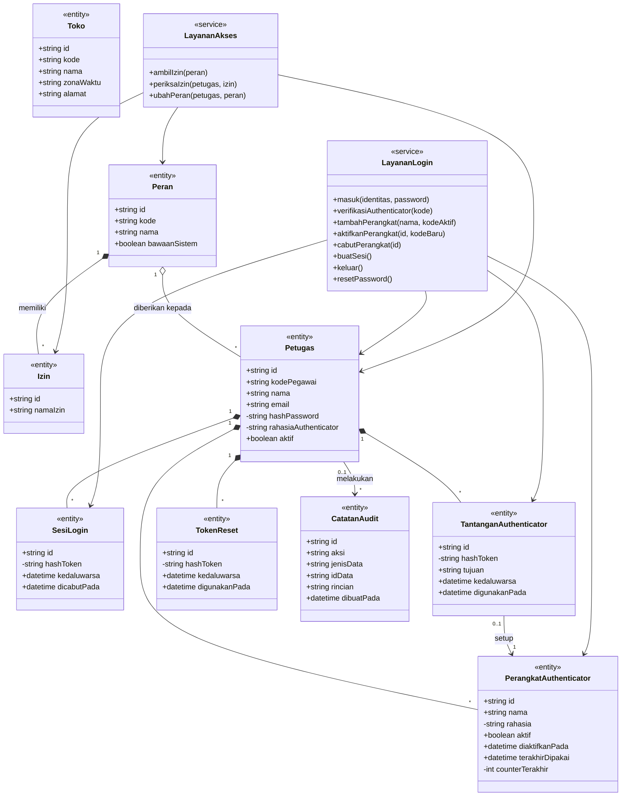
```mermaid
classDiagram
    class Toko {
        <<entity>>
        +string id
        +string kode
        +string nama
        +string zonaWaktu
        +string alamat
    }

    class Peran {
        <<entity>>
        +string id
        +string kode
        +string nama
        +boolean bawaanSistem
    }

    class Izin {
        <<entity>>
        +string id
        +string namaIzin
    }

    class Petugas {
        <<entity>>
        +string id
        +string kodePegawai
        +string nama
        +string email
        -string hashPassword
        -string rahasiaAuthenticator
        +boolean aktif
    }

    class SesiLogin {
        <<entity>>
        +string id
        -string hashToken
        +datetime kedaluwarsa
        +datetime dicabutPada
    }

    class PerangkatAuthenticator {
        <<entity>>
        +string id
        +string nama
        -string rahasia
        +boolean aktif
        +datetime diaktifkanPada
        +datetime terakhirDipakai
        -int counterTerakhir
    }

    class TantanganAuthenticator {
        <<entity>>
        +string id
        -string hashToken
        +string tujuan
        +datetime kedaluwarsa
        +datetime digunakanPada
    }

    class TokenReset {
        <<entity>>
        +string id
        -string hashToken
        +datetime kedaluwarsa
        +datetime digunakanPada
    }

    class CatatanAudit {
        <<entity>>
        +string id
        +string aksi
        +string jenisData
        +string idData
        +string rincian
        +datetime dibuatPada
    }

    class LayananLogin {
        <<service>>
        +masuk(identitas, password)
        +verifikasiAuthenticator(kode)
        +tambahPerangkat(nama, kodeAktif)
        +aktifkanPerangkat(id, kodeBaru)
        +cabutPerangkat(id)
        +buatSesi()
        +keluar()
        +resetPassword()
    }

    class LayananAkses {
        <<service>>
        +ambilIzin(peran)
        +periksaIzin(petugas, izin)
        +ubahPeran(petugas, peran)
    }

    Peran "1" *-- "*" Izin : memiliki
    Peran "1" o-- "*" Petugas : diberikan kepada
    Petugas "1" *-- "*" SesiLogin
    Petugas "1" *-- "*" PerangkatAuthenticator
    Petugas "1" *-- "*" TantanganAuthenticator
    TantanganAuthenticator "0..1" --> "1" PerangkatAuthenticator : setup
    Petugas "1" *-- "*" TokenReset
    Petugas "0..1" --> "*" CatatanAudit : melakukan
    LayananLogin --> Petugas
    LayananLogin --> SesiLogin
    LayananLogin --> PerangkatAuthenticator
    LayananLogin --> TantanganAuthenticator
    LayananAkses --> Peran
    LayananAkses --> Izin
    LayananAkses --> Petugas
```

Password, PIN, token, dan rahasia Authenticator tidak dikirim sebagai data biasa.
Nilainya disimpan sebagai hash atau dibatasi hanya untuk proses autentikasi. Ini
merupakan contoh enkapsulasi keamanan.

Satu `Petugas` dapat memiliki perangkat Authenticator sebanyak yang dibutuhkan.
Setiap perangkat mempunyai secret dan counter anti-replay sendiri. Penambahan
perangkat harus disahkan oleh kode perangkat aktif, sedangkan perangkat aktif
terakhir tidak boleh dicabut agar akun tidak terkunci.

## 6. Class Diagram Produk dan Persediaan

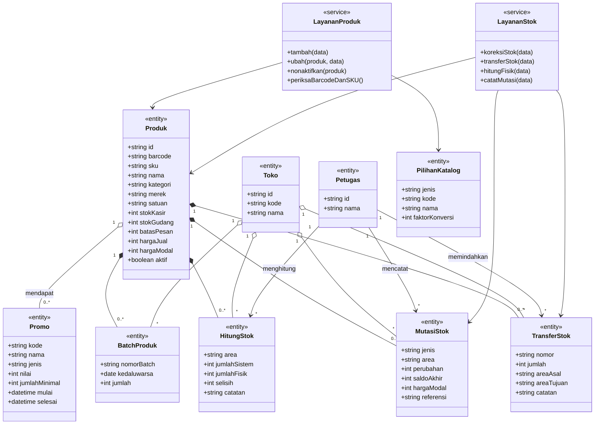
```mermaid
classDiagram
    class Toko {
        <<entity>>
        +string id
        +string kode
        +string nama
    }

    class Petugas {
        <<entity>>
        +string id
        +string nama
    }

    class Produk {
        <<entity>>
        +string id
        +string barcode
        +string sku
        +string nama
        +string kategori
        +string merek
        +string satuan
        +int stokKasir
        +int stokGudang
        +int batasPesan
        +int hargaJual
        +int hargaModal
        +boolean aktif
    }

    class PilihanKatalog {
        <<entity>>
        +string jenis
        +string kode
        +string nama
        +int faktorKonversi
    }

    class Promo {
        <<entity>>
        +string kode
        +string nama
        +string jenis
        +int nilai
        +int jumlahMinimal
        +datetime mulai
        +datetime selesai
    }

    class BatchProduk {
        <<entity>>
        +string nomorBatch
        +date kedaluwarsa
        +int jumlah
    }

    class HitungStok {
        <<entity>>
        +string area
        +int jumlahSistem
        +int jumlahFisik
        +int selisih
        +string catatan
    }

    class MutasiStok {
        <<entity>>
        +string jenis
        +string area
        +int perubahan
        +int saldoAkhir
        +int hargaModal
        +string referensi
    }

    class TransferStok {
        <<entity>>
        +string nomor
        +int jumlah
        +string areaAsal
        +string areaTujuan
        +string catatan
    }

    class LayananProduk {
        <<service>>
        +tambah(data)
        +ubah(produk, data)
        +nonaktifkan(produk)
        +periksaBarcodeDanSKU()
    }

    class LayananStok {
        <<service>>
        +koreksiStok(data)
        +transferStok(data)
        +hitungFisik(data)
        +catatMutasi(data)
    }

    Produk "1" o-- "0..*" Promo : mendapat
    Produk "1" *-- "0..*" BatchProduk
    Produk "1" *-- "0..*" HitungStok
    Produk "1" *-- "0..*" MutasiStok
    Produk "1" *-- "0..*" TransferStok
    Toko "1" o-- "*" BatchProduk
    Toko "1" o-- "*" HitungStok
    Toko "1" o-- "*" MutasiStok
    Toko "1" o-- "*" TransferStok
    Petugas "1" --> "*" HitungStok : menghitung
    Petugas "1" --> "*" MutasiStok : mencatat
    Petugas "1" --> "*" TransferStok : memindahkan
    LayananProduk --> Produk
    LayananProduk --> PilihanKatalog
    LayananStok --> Produk
    LayananStok --> MutasiStok
    LayananStok --> TransferStok
```

## 7. Class Diagram Pembelian dan Pemasok

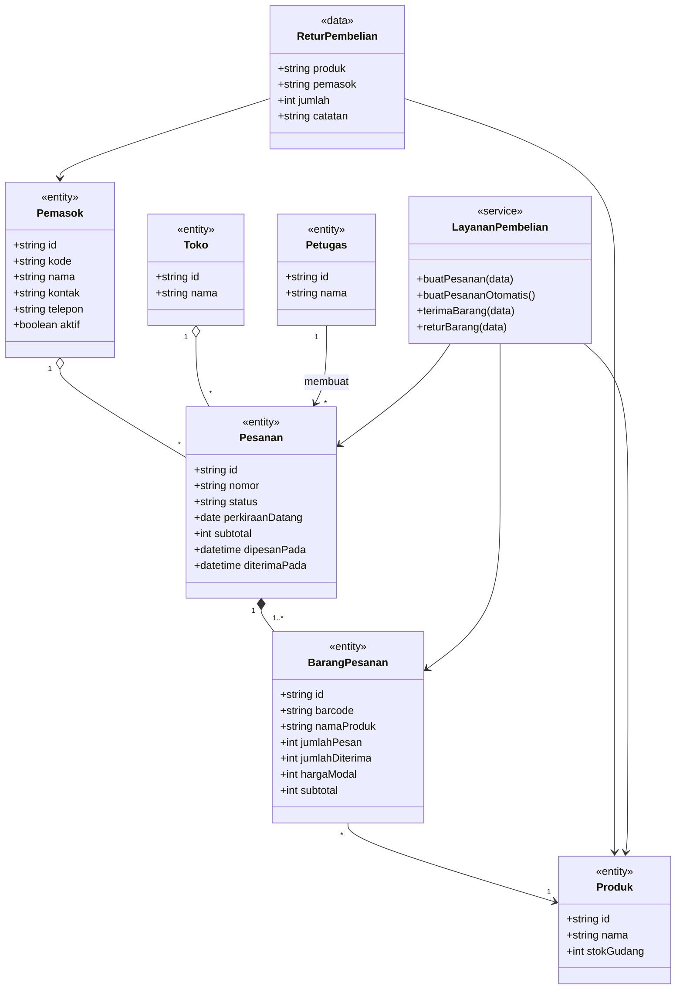
```mermaid
classDiagram
    class Toko {
        <<entity>>
        +string id
        +string nama
    }

    class Petugas {
        <<entity>>
        +string id
        +string nama
    }

    class Pemasok {
        <<entity>>
        +string id
        +string kode
        +string nama
        +string kontak
        +string telepon
        +boolean aktif
    }

    class Pesanan {
        <<entity>>
        +string id
        +string nomor
        +string status
        +date perkiraanDatang
        +int subtotal
        +datetime dipesanPada
        +datetime diterimaPada
    }

    class BarangPesanan {
        <<entity>>
        +string id
        +string barcode
        +string namaProduk
        +int jumlahPesan
        +int jumlahDiterima
        +int hargaModal
        +int subtotal
    }

    class Produk {
        <<entity>>
        +string id
        +string nama
        +int stokGudang
    }

    class ReturPembelian {
        <<data>>
        +string produk
        +string pemasok
        +int jumlah
        +string catatan
    }

    class LayananPembelian {
        <<service>>
        +buatPesanan(data)
        +buatPesananOtomatis()
        +terimaBarang(data)
        +returBarang(data)
    }

    Pemasok "1" o-- "*" Pesanan
    Toko "1" o-- "*" Pesanan
    Petugas "1" --> "*" Pesanan : membuat
    Pesanan "1" *-- "1..*" BarangPesanan
    BarangPesanan "*" --> "1" Produk
    ReturPembelian --> Produk
    ReturPembelian --> Pemasok
    LayananPembelian --> Pesanan
    LayananPembelian --> BarangPesanan
    LayananPembelian --> Produk
```

Ketika barang diterima, jumlah pada `BarangPesanan` bertambah, stok gudang pada
`Produk` diperbarui, dan `MutasiStok` dibuat sebagai jejak perubahan.

## 8. Class Diagram Kasir dan Penjualan

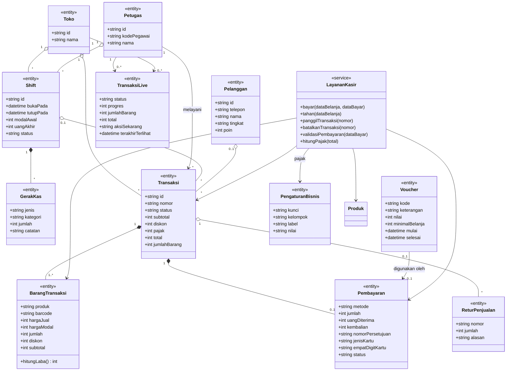
```mermaid
classDiagram
    class Toko {
        <<entity>>
        +string id
        +string nama
    }

    class Petugas {
        <<entity>>
        +string id
        +string kodePegawai
        +string nama
    }

    class Pelanggan {
        <<entity>>
        +string id
        +string telepon
        +string nama
        +string tingkat
        +int poin
    }

    class Shift {
        <<entity>>
        +string id
        +datetime bukaPada
        +datetime tutupPada
        +int modalAwal
        +int uangAkhir
        +string status
    }

    class GerakKas {
        <<entity>>
        +string jenis
        +string kategori
        +int jumlah
        +string catatan
    }

    class Transaksi {
        <<entity>>
        +string id
        +string nomor
        +string status
        +int subtotal
        +int diskon
        +int pajak
        +int total
        +int jumlahBarang
    }

    class BarangTransaksi {
        <<entity>>
        +string produk
        +string barcode
        +int hargaJual
        +int hargaModal
        +int jumlah
        +int diskon
        +int subtotal
        +hitungLaba() int
    }

    class Pembayaran {
        <<entity>>
        +string metode
        +int jumlah
        +int uangDiterima
        +int kembalian
        +string nomorPersetujuan
        +string jenisKartu
        +string empatDigitKartu
        +string status
    }

    class Voucher {
        <<entity>>
        +string kode
        +string keterangan
        +int nilai
        +int minimalBelanja
        +datetime mulai
        +datetime selesai
    }

    class TransaksiLive {
        <<entity>>
        +string status
        +int progres
        +int jumlahBarang
        +int total
        +string aksiSekarang
        +datetime terakhirTerlihat
    }

    class ReturPenjualan {
        <<entity>>
        +string nomor
        +int jumlah
        +string alasan
    }

    class PengaturanBisnis {
        <<entity>>
        +string kunci
        +string kelompok
        +string label
        +string nilai
    }

    class LayananKasir {
        <<service>>
        +bayar(dataBelanja, dataBayar)
        +tahan(dataBelanja)
        +panggilTransaksi(nomor)
        +batalkanTransaksi(nomor)
        +validasiPembayaran(dataBayar)
        +hitungPajak(total)
    }

    Toko "1" o-- "*" Shift
    Petugas "1" o-- "*" Shift
    Shift "1" *-- "*" GerakKas
    Toko "1" o-- "*" Transaksi
    Petugas "1" --> "*" Transaksi : melayani
    Shift "0..1" o-- "*" Transaksi
    Pelanggan "0..1" o-- "*" Transaksi
    Transaksi "1" *-- "1..*" BarangTransaksi
    Transaksi "1" *-- "0..1" Pembayaran
    Transaksi "1" o-- "*" ReturPenjualan
    Voucher "0..1" --> "0..1" Pembayaran : digunakan oleh
    Petugas "1" --> "0..*" TransaksiLive
    Toko "1" --> "0..*" TransaksiLive
    LayananKasir --> Transaksi
    LayananKasir --> BarangTransaksi
    LayananKasir --> Pembayaran
    LayananKasir --> Produk
    LayananKasir --> PengaturanBisnis : pajak
```

`BarangTransaksi` menyimpan nama, harga jual, dan harga modal pada saat transaksi.
Karena itu laporan lama tetap konsisten walaupun harga produk kemudian berubah.

## 9. Bentuk Data API Kasir

Nama data disederhanakan agar alurnya mudah dibaca.

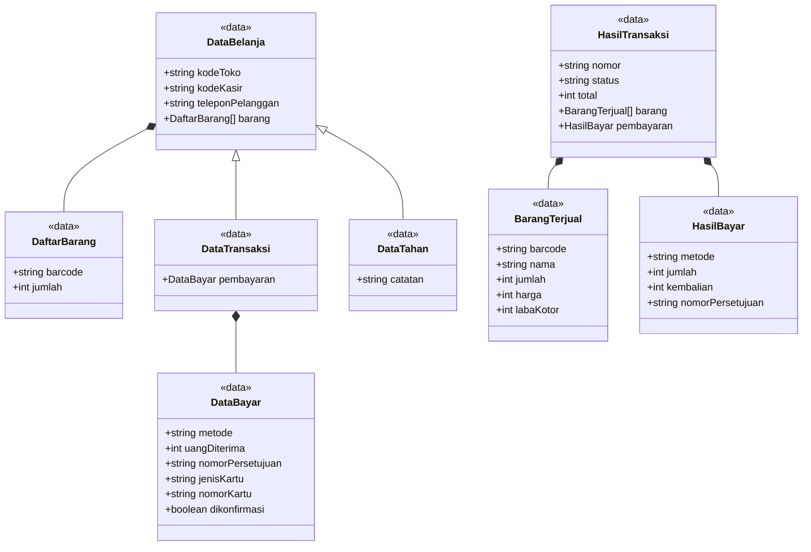
```mermaid
classDiagram
    class DataBelanja {
        <<data>>
        +string kodeToko
        +string kodeKasir
        +string teleponPelanggan
        +DaftarBarang[] barang
    }

    class DaftarBarang {
        <<data>>
        +string barcode
        +int jumlah
    }

    class DataBayar {
        <<data>>
        +string metode
        +int uangDiterima
        +string nomorPersetujuan
        +string jenisKartu
        +string nomorKartu
        +boolean dikonfirmasi
    }

    class DataTransaksi {
        <<data>>
        +DataBayar pembayaran
    }

    class DataTahan {
        <<data>>
        +string catatan
    }

    class HasilTransaksi {
        <<data>>
        +string nomor
        +string status
        +int total
        +BarangTerjual[] barang
        +HasilBayar pembayaran
    }

    class BarangTerjual {
        <<data>>
        +string barcode
        +string nama
        +int jumlah
        +int harga
        +int labaKotor
    }

    class HasilBayar {
        <<data>>
        +string metode
        +int jumlah
        +int kembalian
        +string nomorPersetujuan
    }

    DataBelanja <|-- DataTransaksi
    DataBelanja <|-- DataTahan
    DataBelanja *-- DaftarBarang
    DataTransaksi *-- DataBayar
    HasilTransaksi *-- BarangTerjual
    HasilTransaksi *-- HasilBayar
```

Pada kode asli, `DataBelanja` adalah `SaleBaseCreate`, `DataTransaksi` adalah
`CheckoutCreate`, dan `DataTahan` adalah `HoldCreate`.

## 10. Class Diagram Keuangan dan Laporan

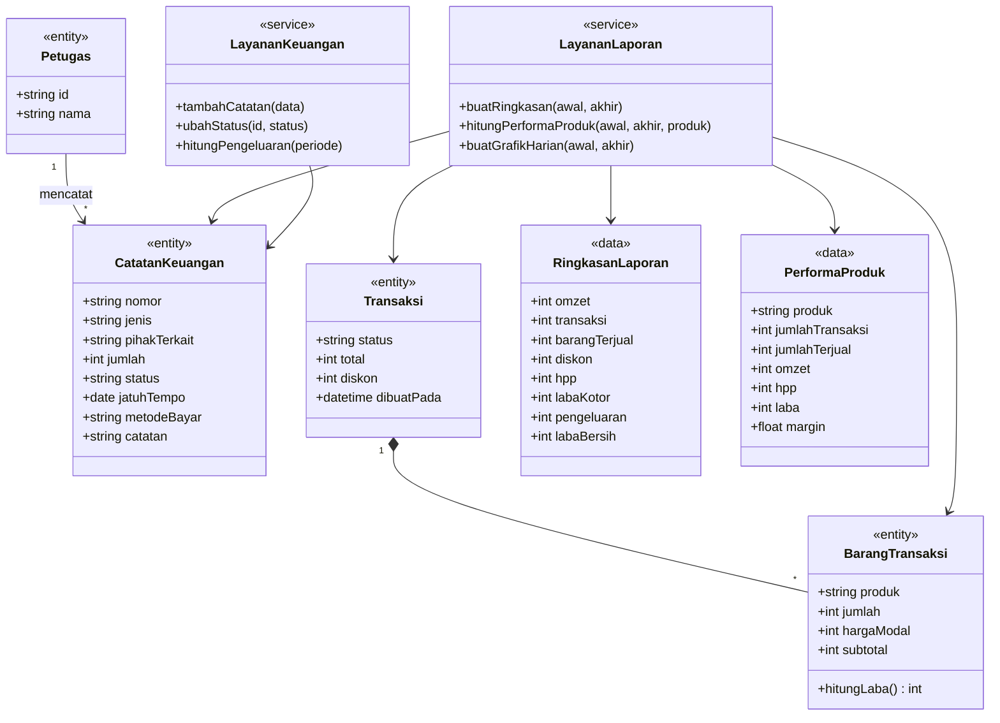
```mermaid
classDiagram
    class Petugas {
        <<entity>>
        +string id
        +string nama
    }

    class CatatanKeuangan {
        <<entity>>
        +string nomor
        +string jenis
        +string pihakTerkait
        +int jumlah
        +string status
        +date jatuhTempo
        +string metodeBayar
        +string catatan
    }

    class Transaksi {
        <<entity>>
        +string status
        +int total
        +int diskon
        +datetime dibuatPada
    }

    class BarangTransaksi {
        <<entity>>
        +string produk
        +int jumlah
        +int hargaModal
        +int subtotal
        +hitungLaba() int
    }

    class RingkasanLaporan {
        <<data>>
        +int omzet
        +int transaksi
        +int barangTerjual
        +int diskon
        +int hpp
        +int labaKotor
        +int pengeluaran
        +int labaBersih
    }

    class PerformaProduk {
        <<data>>
        +string produk
        +int jumlahTransaksi
        +int jumlahTerjual
        +int omzet
        +int hpp
        +int laba
        +float margin
    }

    class LayananLaporan {
        <<service>>
        +buatRingkasan(awal, akhir)
        +hitungPerformaProduk(awal, akhir, produk)
        +buatGrafikHarian(awal, akhir)
    }

    class LayananKeuangan {
        <<service>>
        +tambahCatatan(data)
        +ubahStatus(id, status)
        +hitungPengeluaran(periode)
    }

    Petugas "1" --> "*" CatatanKeuangan : mencatat
    Transaksi "1" *-- "*" BarangTransaksi
    LayananLaporan --> Transaksi
    LayananLaporan --> BarangTransaksi
    LayananLaporan --> CatatanKeuangan
    LayananLaporan --> RingkasanLaporan
    LayananLaporan --> PerformaProduk
    LayananKeuangan --> CatatanKeuangan
```

Laporan hanya menghitung `Transaksi` dengan status selesai. Transaksi tahan dan
transaksi batal tidak masuk omzet.

## 11. Class Diagram Chat CEO

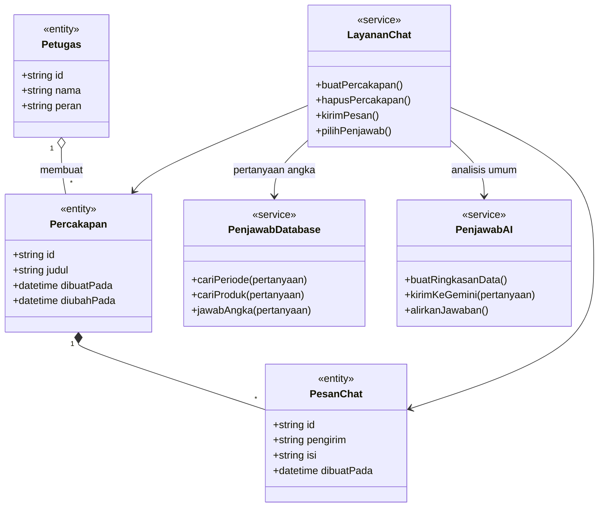
```mermaid
classDiagram
    class Petugas {
        <<entity>>
        +string id
        +string nama
        +string peran
    }

    class Percakapan {
        <<entity>>
        +string id
        +string judul
        +datetime dibuatPada
        +datetime diubahPada
    }

    class PesanChat {
        <<entity>>
        +string id
        +string pengirim
        +string isi
        +datetime dibuatPada
    }

    class PenjawabDatabase {
        <<service>>
        +cariPeriode(pertanyaan)
        +cariProduk(pertanyaan)
        +jawabAngka(pertanyaan)
    }

    class PenjawabAI {
        <<service>>
        +buatRingkasanData()
        +kirimKeGemini(pertanyaan)
        +alirkanJawaban()
    }

    class LayananChat {
        <<service>>
        +buatPercakapan()
        +hapusPercakapan()
        +kirimPesan()
        +pilihPenjawab()
    }

    Petugas "1" o-- "*" Percakapan : membuat
    Percakapan "1" *-- "*" PesanChat
    LayananChat --> Percakapan
    LayananChat --> PesanChat
    LayananChat --> PenjawabDatabase : pertanyaan angka
    LayananChat --> PenjawabAI : analisis umum
```

Angka omzet, laba, stok, dan performa produk dijawab oleh `PenjawabDatabase` dari
database MYMARKET. `PenjawabAI` digunakan untuk pertanyaan yang memerlukan bahasa
atau analisis umum.

## 12. Sequence Diagram Login

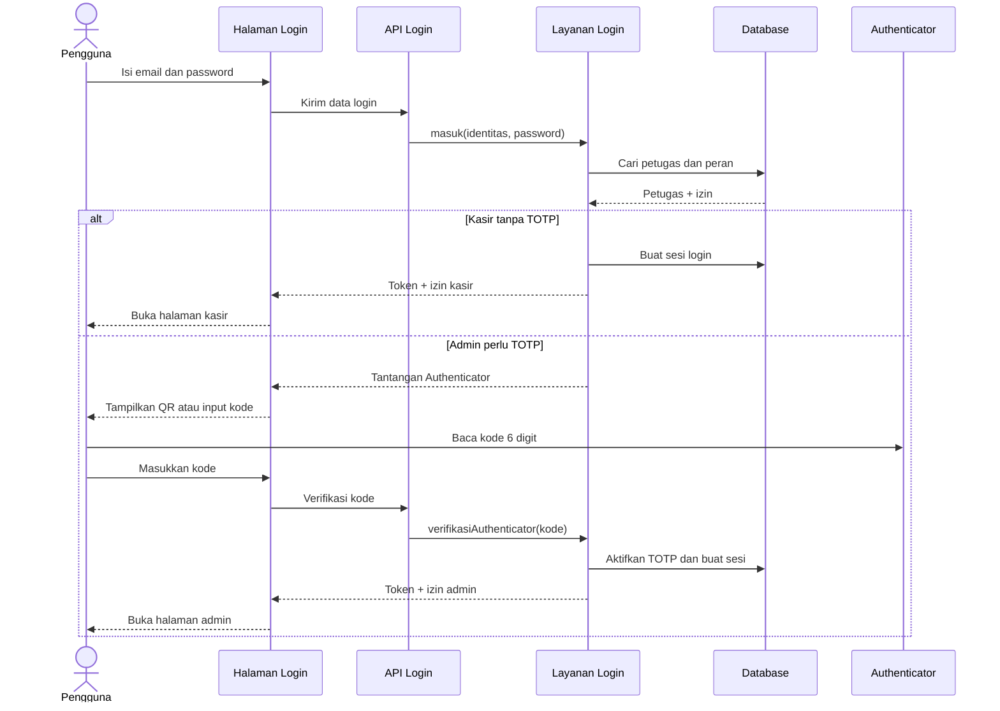
```mermaid
sequenceDiagram
    actor Pengguna
    participant Halaman as Halaman Login
    participant API as API Login
    participant Login as Layanan Login
    participant DB as Database
    participant App as Authenticator

    Pengguna->>Halaman: Isi email dan password
    Halaman->>API: Kirim data login
    API->>Login: masuk(identitas, password)
    Login->>DB: Cari petugas dan peran
    DB-->>Login: Petugas + izin

    alt Kasir tanpa TOTP
        Login->>DB: Buat sesi login
        Login-->>Halaman: Token + izin kasir
        Halaman-->>Pengguna: Buka halaman kasir
    else Admin perlu TOTP
        Login-->>Halaman: Tantangan Authenticator
        Halaman-->>Pengguna: Tampilkan QR atau input kode
        Pengguna->>App: Baca kode 6 digit
        Pengguna->>Halaman: Masukkan kode
        Halaman->>API: Verifikasi kode
        API->>Login: verifikasiAuthenticator(kode)
        Login->>DB: Aktifkan TOTP dan buat sesi
        Login-->>Halaman: Token + izin admin
        Halaman-->>Pengguna: Buka halaman admin
    end
```

## 13. Sequence Diagram Pembayaran Kasir

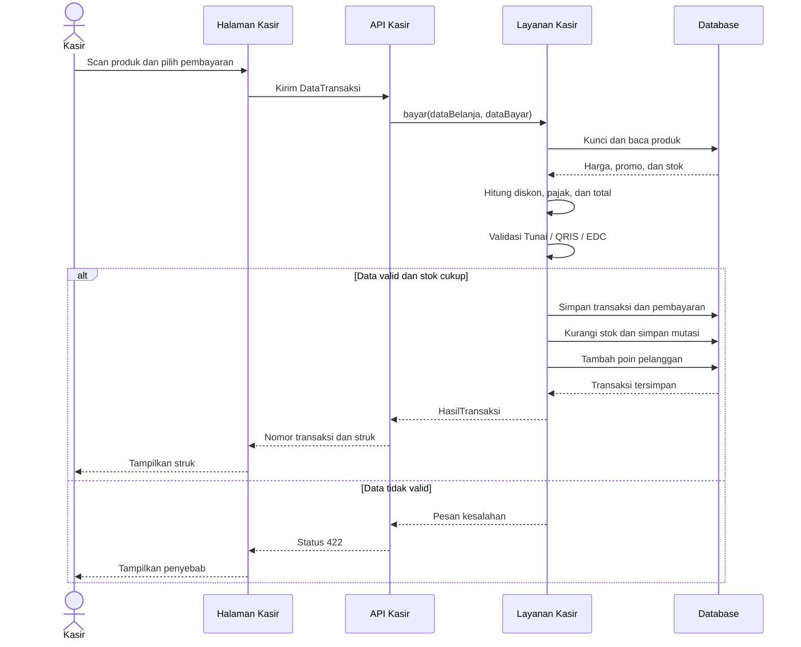
```mermaid
sequenceDiagram
    actor Kasir
    participant POS as Halaman Kasir
    participant API as API Kasir
    participant Jual as Layanan Kasir
    participant DB as Database

    Kasir->>POS: Scan produk dan pilih pembayaran
    POS->>API: Kirim DataTransaksi
    API->>Jual: bayar(dataBelanja, dataBayar)
    Jual->>DB: Kunci dan baca produk
    DB-->>Jual: Harga, promo, dan stok
    Jual->>Jual: Hitung diskon, pajak, dan total
    Jual->>Jual: Validasi Tunai / QRIS / EDC

    alt Data valid dan stok cukup
        Jual->>DB: Simpan transaksi dan pembayaran
        Jual->>DB: Kurangi stok dan simpan mutasi
        Jual->>DB: Tambah poin pelanggan
        DB-->>Jual: Transaksi tersimpan
        Jual-->>API: HasilTransaksi
        API-->>POS: Nomor transaksi dan struk
        POS-->>Kasir: Tampilkan struk
    else Data tidak valid
        Jual-->>API: Pesan kesalahan
        API-->>POS: Status 422
        POS-->>Kasir: Tampilkan penyebab
    end
```

## 14. Sequence Diagram Pembelian dan Stok

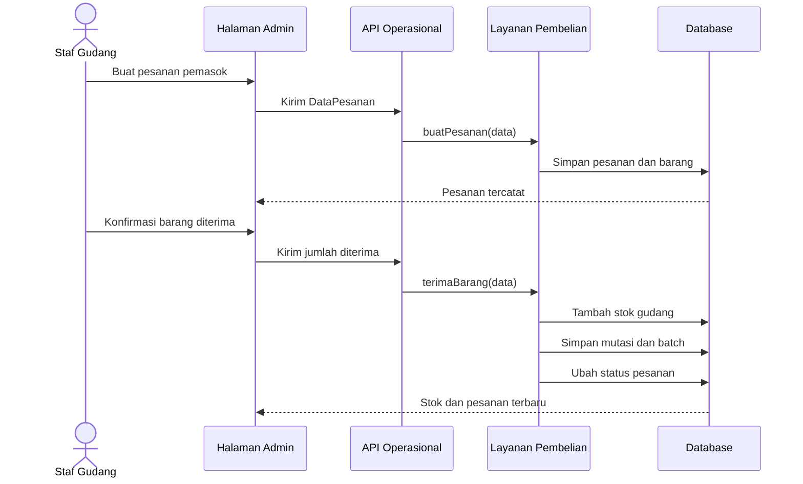
```mermaid
sequenceDiagram
    actor Gudang as Staf Gudang
    participant Admin as Halaman Admin
    participant API as API Operasional
    participant Beli as Layanan Pembelian
    participant DB as Database

    Gudang->>Admin: Buat pesanan pemasok
    Admin->>API: Kirim DataPesanan
    API->>Beli: buatPesanan(data)
    Beli->>DB: Simpan pesanan dan barang
    DB-->>Admin: Pesanan tercatat

    Gudang->>Admin: Konfirmasi barang diterima
    Admin->>API: Kirim jumlah diterima
    API->>Beli: terimaBarang(data)
    Beli->>DB: Tambah stok gudang
    Beli->>DB: Simpan mutasi dan batch
    Beli->>DB: Ubah status pesanan
    DB-->>Admin: Stok dan pesanan terbaru
```

## 15. Sequence Diagram Laporan dan Chat CEO

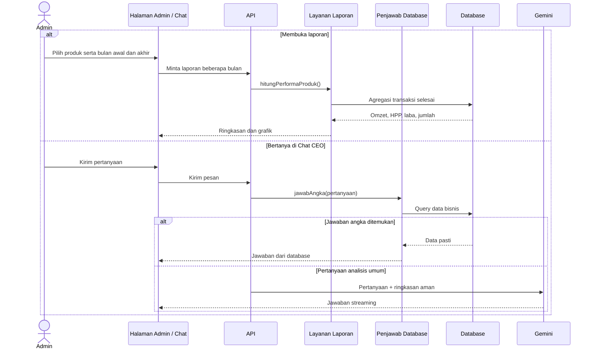
```mermaid
sequenceDiagram
    actor Admin
    participant UI as Halaman Admin / Chat
    participant API
    participant Laporan as Layanan Laporan
    participant Jawab as Penjawab Database
    participant DB as Database
    participant AI as Gemini

    alt Membuka laporan
        Admin->>UI: Pilih produk serta bulan awal dan akhir
        UI->>API: Minta laporan beberapa bulan
        API->>Laporan: hitungPerformaProduk()
        Laporan->>DB: Agregasi transaksi selesai
        DB-->>Laporan: Omzet, HPP, laba, jumlah
        Laporan-->>UI: Ringkasan dan grafik
    else Bertanya di Chat CEO
        Admin->>UI: Kirim pertanyaan
        UI->>API: Kirim pesan
        API->>Jawab: jawabAngka(pertanyaan)
        Jawab->>DB: Query data bisnis
        alt Jawaban angka ditemukan
            DB-->>Jawab: Data pasti
            Jawab-->>UI: Jawaban dari database
        else Pertanyaan analisis umum
            API->>AI: Pertanyaan + ringkasan aman
            AI-->>UI: Jawaban streaming
        end
    end
```

## 16. State Diagram Transaksi

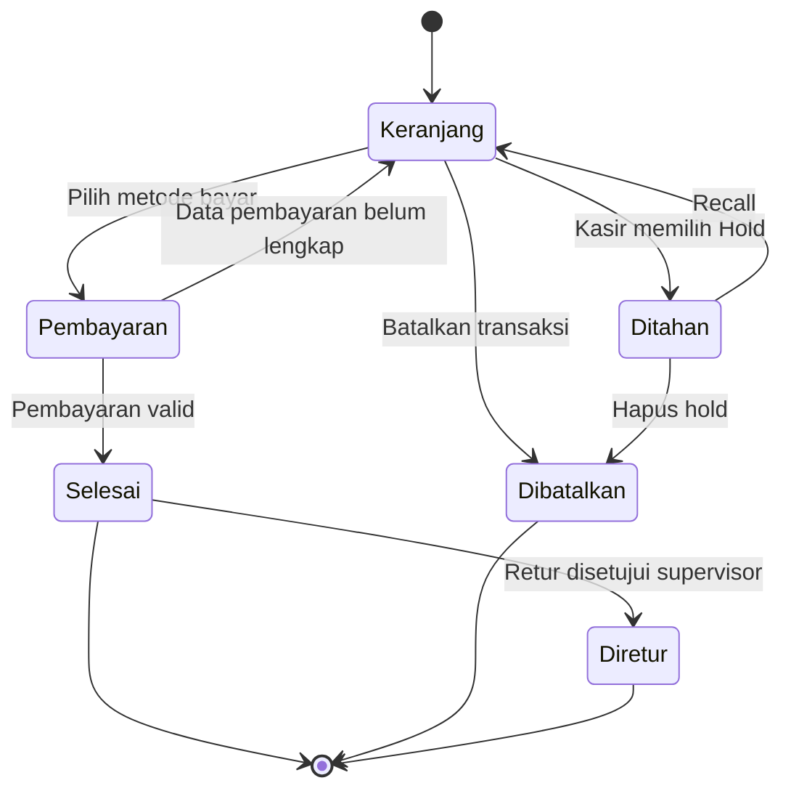
```mermaid
stateDiagram-v2
    [*] --> Keranjang
    Keranjang --> Ditahan: Kasir memilih Hold
    Ditahan --> Keranjang: Recall
    Keranjang --> Pembayaran: Pilih metode bayar
    Pembayaran --> Selesai: Pembayaran valid
    Pembayaran --> Keranjang: Data pembayaran belum lengkap
    Keranjang --> Dibatalkan: Batalkan transaksi
    Ditahan --> Dibatalkan: Hapus hold
    Selesai --> Diretur: Retur disetujui supervisor
    Selesai --> [*]
    Dibatalkan --> [*]
    Diretur --> [*]
```

Status yang tersimpan pada tabel transaksi utama adalah `held`, `completed`, dan
`cancelled`. `Keranjang` serta `Pembayaran` adalah keadaan antarmuka sebelum data
akhir disimpan.

## 17. State Diagram Pesanan Pembelian

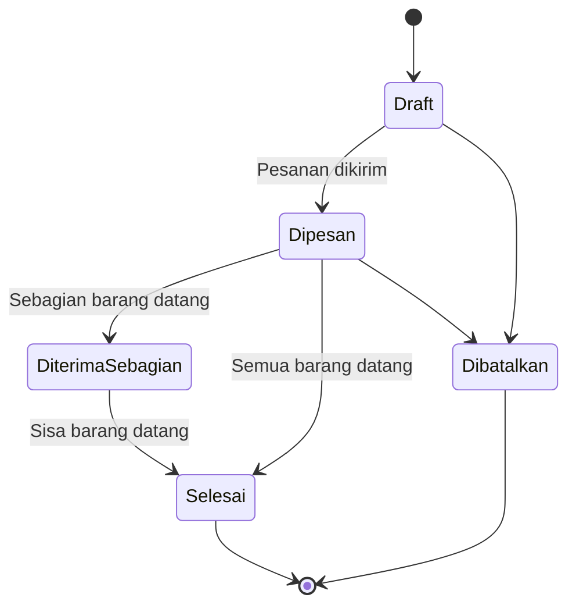
```mermaid
stateDiagram-v2
    [*] --> Draft
    Draft --> Dipesan: Pesanan dikirim
    Dipesan --> DiterimaSebagian: Sebagian barang datang
    Dipesan --> Selesai: Semua barang datang
    DiterimaSebagian --> Selesai: Sisa barang datang
    Draft --> Dibatalkan
    Dipesan --> Dibatalkan
    Selesai --> [*]
    Dibatalkan --> [*]
```

## 18. Activity Diagram Checkout

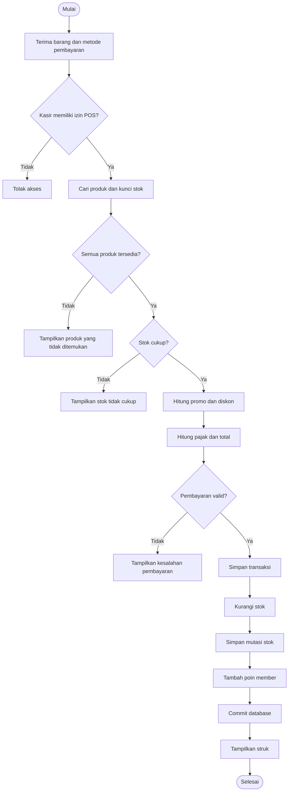
```mermaid
flowchart TD
    A([Mulai]) --> B[Terima barang dan metode pembayaran]
    B --> C{Kasir memiliki izin POS?}
    C -- Tidak --> X[Tolak akses]
    C -- Ya --> D[Cari produk dan kunci stok]
    D --> E{Semua produk tersedia?}
    E -- Tidak --> Y[Tampilkan produk yang tidak ditemukan]
    E -- Ya --> F{Stok cukup?}
    F -- Tidak --> Z[Tampilkan stok tidak cukup]
    F -- Ya --> G[Hitung promo dan diskon]
    G --> H[Hitung pajak dan total]
    H --> I{Pembayaran valid?}
    I -- Tidak --> J[Tampilkan kesalahan pembayaran]
    I -- Ya --> K[Simpan transaksi]
    K --> L[Kurangi stok]
    L --> M[Simpan mutasi stok]
    M --> N[Tambah poin member]
    N --> O[Commit database]
    O --> P[Tampilkan struk]
    P --> Q([Selesai])
```

## 19. Peta Nama Diagram ke Class Python

### Model database

| Nama sederhana | Class asli | Tabel | Lokasi |
| --- | --- | --- | --- |
| BaseWaktu | `TimestampMixin` | — | `back/app/models.py` |
| Toko | `Store` | `stores` | `back/app/models.py` |
| Peran | `AccessRole` | `roles` | `back/app/models.py` |
| Izin | `RolePermission` | `role_permissions` | `back/app/models.py` |
| Petugas | `Cashier` | `cashiers` | `back/app/models.py` |
| Produk | `Product` | `products` | `back/app/models.py` |
| Pemasok | `Supplier` | `suppliers` | `back/app/models.py` |
| Pesanan | `PurchaseOrder` | `purchase_orders` | `back/app/models.py` |
| BarangPesanan | `PurchaseOrderItem` | `purchase_order_items` | `back/app/models.py` |
| MutasiStok | `StockMovement` | `stock_movements` | `back/app/models.py` |
| TransferStok | `StockTransfer` | `stock_transfers` | `back/app/models.py` |
| Pelanggan | `Member` | `members` | `back/app/models.py` |
| Shift | `Shift` | `shifts` | `back/app/models.py` |
| GerakKas | `CashMovement` | `cash_movements` | `back/app/models.py` |
| Voucher | `Voucher` | `vouchers` | `back/app/models.py` |
| Transaksi | `Sale` | `sales` | `back/app/models.py` |
| BarangTransaksi | `SaleItem` | `sale_items` | `back/app/models.py` |
| Pembayaran | `Payment` | `payments` | `back/app/models.py` |
| TransaksiLive | `LiveTransaction` | `live_transactions` | `back/app/models.py` |
| PilihanKatalog | `CatalogOption` | `catalog_options` | `back/app/models.py` |
| Promo | `Promotion` | `promotions` | `back/app/models.py` |
| BatchProduk | `ProductBatch` | `product_batches` | `back/app/models.py` |
| HitungStok | `StockCount` | `stock_counts` | `back/app/models.py` |
| ReturPenjualan | `SaleReturn` | `sale_returns` | `back/app/models.py` |
| CatatanKeuangan | `FinanceEntry` | `finance_entries` | `back/app/models.py` |
| PengaturanBisnis | `BusinessSetting` | `business_settings` | `back/app/models.py` |
| CatatanAudit | `AuditLog` | `audit_logs` | `back/app/models.py` |
| SesiLogin | `AuthSession` | `auth_sessions` | `back/app/models.py` |
| PerangkatAuthenticator | `TotpDevice` | `totp_devices` | `back/app/models.py` |
| TantanganAuthenticator | `TotpChallenge` | `totp_challenges` | `back/app/models.py` |
| TokenReset | `PasswordResetToken` | `password_reset_tokens` | `back/app/models.py` |
| Percakapan | `CeoChatSession` | `ceo_chat_sessions` | `back/app/models.py` |
| PesanChat | `CeoChatMessage` | `ceo_chat_messages` | `back/app/models.py` |

### Data API yang sering digunakan

| Nama sederhana | Class asli | Kegunaan |
| --- | --- | --- |
| DataProduk | `ProductCreate`, `ProductUpdate`, `ProductRead` | Tambah, ubah, dan membaca produk |
| DaftarBarang | `SaleLineCreate` | Barcode dan jumlah barang dalam keranjang |
| DataBelanja | `SaleBaseCreate` | Data dasar kasir, toko, pelanggan, dan barang |
| DataTransaksi | `CheckoutCreate` | Data checkout yang memiliki pembayaran |
| DataTahan | `HoldCreate` | Menahan transaksi dengan catatan |
| DataBayar | `PaymentCreate` | Tunai, QRIS, EDC, atau voucher |
| HasilTransaksi | `SaleRead` | Transaksi lengkap untuk struk |
| DataPesanan | `DirectPurchaseCreate`, `PurchaseOrderDraftCreate` | Pembelian langsung atau pesanan pemasok |
| DataTerimaBarang | `PurchaseReceiveCreate` | Jumlah barang pesanan yang diterima |
| ReturPembelian | `PurchaseReturnCreate` | Barang pembelian yang dikembalikan ke pemasok |
| DataKoreksiStok | `StockAdjustmentCreate` | Koreksi stok kasir atau gudang |
| DataTransferStok | `StockTransferCreate` | Perpindahan stok antar-area |
| DataLogin | `LoginCreate` | Email/kode pegawai dan password |
| HasilLogin | `LoginRead` | Status login, token, role, dan izin |
| DataAuthenticator | `TotpVerifyCreate` | Tantangan dan kode 6 digit |
| DataPerangkatAuthenticator | `TotpDeviceCreate`, `TotpDeviceRead` | Tambah dan membaca perangkat Authenticator |
| DataKeuangan | `FinanceEntryCreate`, `FinanceEntryRead` | Catatan pengeluaran dan penerimaan |
| RingkasanLaporan | `AdminSalesReportRead` | Ringkasan laporan bisnis |
| PerformaProduk | `ReportProductPerformance` | Omzet, HPP, laba, dan margin per produk |
| DataChat | `CeoChatCreate`, `CeoChatPrompt` | Percakapan dan pertanyaan pengguna |

### Layanan konseptual

Nama layanan berikut digunakan untuk merangkum fungsi yang sejenis. Nama tersebut
mempermudah UML, tetapi bukan class Python baru yang ditambahkan ke aplikasi.

| Nama sederhana | Implementasi asli | Tanggung jawab |
| --- | --- | --- |
| LayananLogin | `back/app/services/operations.py` | Login, TOTP, sesi, dan profil petugas |
| LayananAkses | `back/app/services/access.py` | Role, izin, dan pembatasan halaman/API |
| LayananProduk | `back/app/services/products.py` | Membaca dan mengubah master produk |
| LayananStok | `back/app/services/inventory.py` | Koreksi, transfer, dan mutasi stok |
| LayananPembelian | `back/app/services/operations.py`, `inventory.py` | PO, penerimaan, dan retur pembelian |
| LayananKasir | `back/app/services/sales.py` | Hold, recall, checkout, pembayaran, dan stok kasir |
| LayananKeuangan | `back/app/services/operations.py` | Penerimaan dan pengeluaran operasional |
| LayananLaporan | `back/app/services/reporting.py` | Omzet, HPP, laba, dan performa produk |
| PenjawabDatabase | `back/app/services/ceo_queries.py` | Jawaban angka yang langsung dihitung dari database |
| PenjawabAI | `back/app/services/ceo_chat.py` | Jawaban bahasa dan analisis umum dengan Gemini |

## 20. Hubungan dengan Empat Pilar PBO

| Pilar | Penerapan pada MYMARKET |
| --- | --- |
| Enkapsulasi | Password, token, aturan stok, pembayaran, serta laporan ditangani melalui model dan service. Halaman tidak mengubah database secara langsung. |
| Abstraksi | Halaman cukup memanggil operasi seperti `bayar`, `buatPesanan`, `koreksiStok`, atau `buatRingkasan`; detail query disembunyikan di backend. |
| Inheritance | Model utama mewarisi `Base` dan banyak model mewarisi `TimestampMixin`. Data checkout dan hold mewarisi data dasar transaksi. |
| Polimorfisme | Bentuk data turunan dapat diperlakukan sebagai data transaksi dasar. Variasi pembayaran saat ini memakai metode yang sama tetapi implementasinya masih berupa percabangan pada service. |

Catatan akademik: pembayaran Tunai, QRIS, dan EDC pada implementasi sekarang belum
menggunakan class turunan yang meng-override metode. Karena itu, bagian tersebut
lebih tepat disebut variasi perilaku berbasis kondisi. Jika diperlukan untuk tugas
PBO murni, bagian itu dapat dikembangkan menjadi `PembayaranTunai`,
`PembayaranQRIS`, dan `PembayaranEDC` yang semuanya mengimplementasikan
`validasi()`.

## 21. Lokasi Kode Utama

| Bagian | File |
| --- | --- |
| Semua model database | `back/app/models.py` |
| Data API kasir, produk, stok, laporan | `back/app/schemas.py` |
| Data API login dan operasional | `back/app/schemas_operations.py` |
| Aturan transaksi kasir | `back/app/services/sales.py` |
| Aturan produk | `back/app/services/products.py` |
| Aturan stok dan pembelian langsung | `back/app/services/inventory.py` |
| Login, shift, PO, keuangan | `back/app/services/operations.py` |
| Hak akses | `back/app/services/access.py` |
| Perhitungan laporan | `back/app/services/reporting.py` |
| Jawaban angka Chat CEO | `back/app/services/ceo_queries.py` |
| API kasir | `back/app/api/kasir.py` |
| API laporan | `back/app/api/laporan_penjualan.py` |
| API analisis produk | `back/app/api/analisis_produk.py` |

